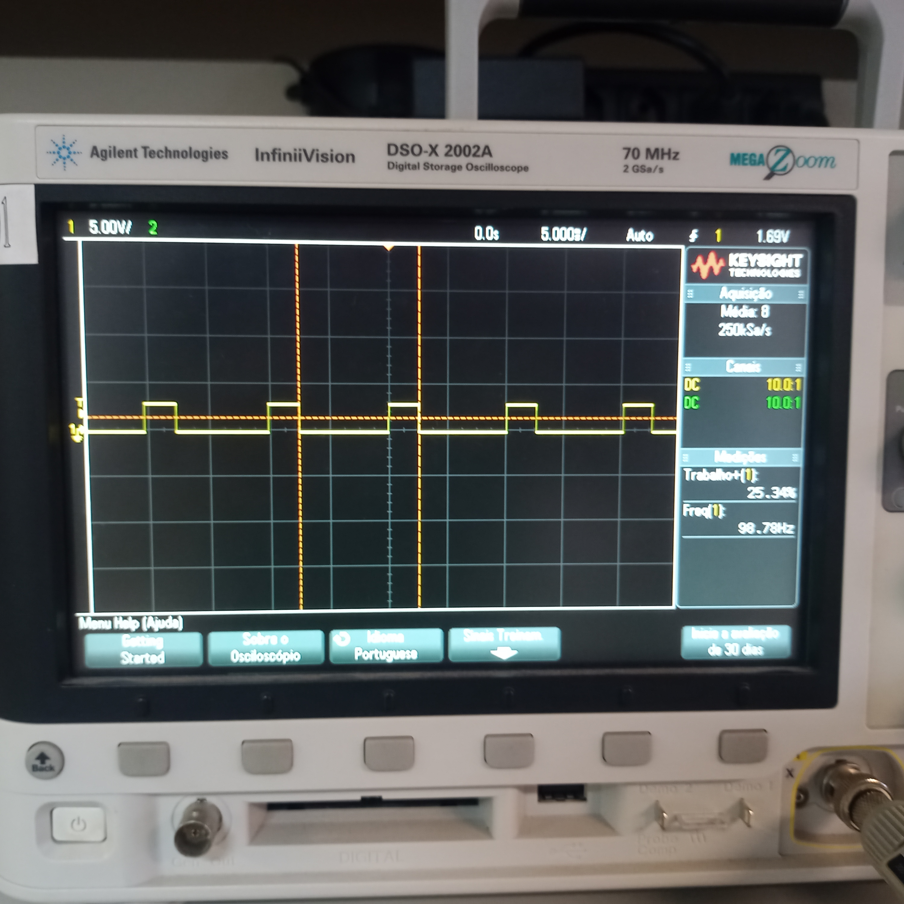
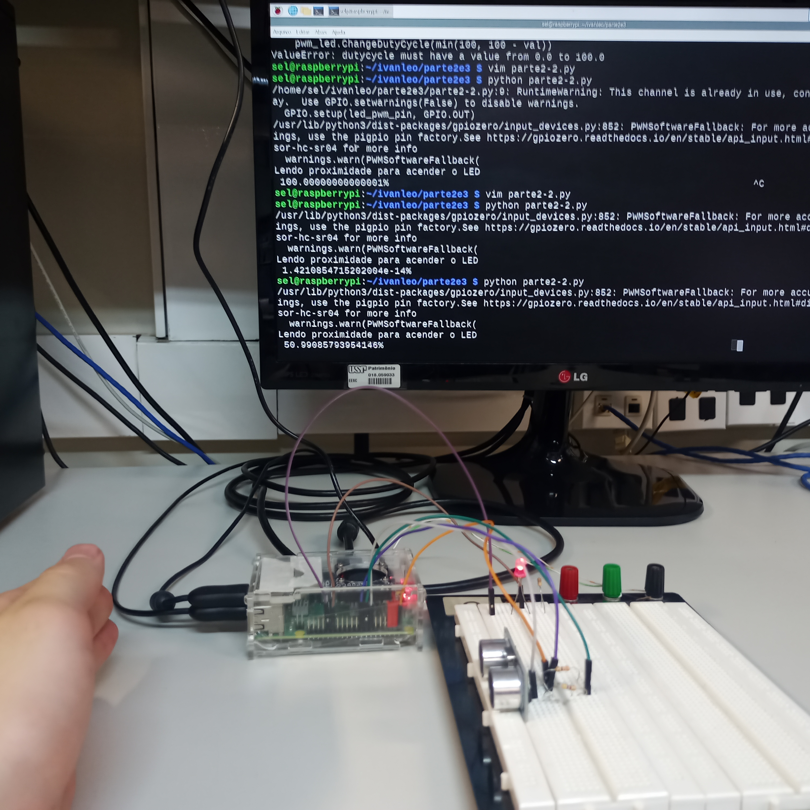
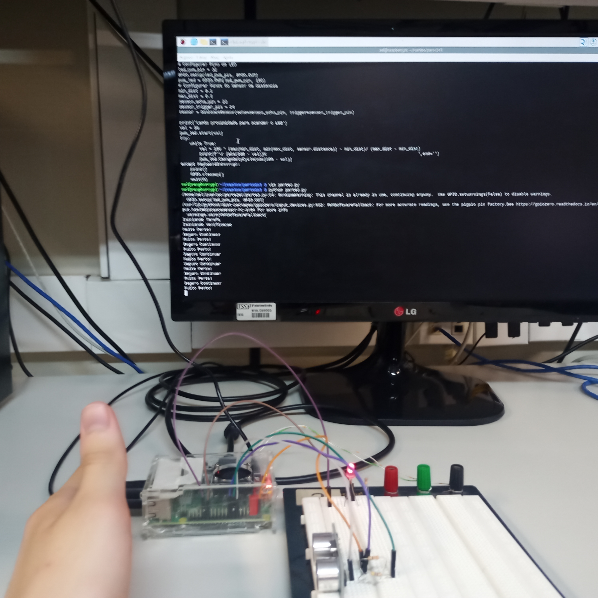

# Pratica 3
**Ivan Roberto Wagner Pancheniak Filho - 12624224**
**Leonardo Rodrigues de Sousa - 10716380**
## Parte 1

Nessa parte foi elaborado um programa em python para fazer o acionamento de um LED
apos uma contagem regressiva com uma placa Raspberry Pi.

Esse codigo se encontra no arquivo [parte1-2.py](parte1-2.py).

## Parte 2

Nessa parte foi utilizado de PWM para um acionamento "analogico" do LED, permitindo
variar a intensidade da luz gerada.

A resposta foi observada em um osciloscopio, como segue na figura abaixo.

O codigo que fez esse acionamento se encontra em [parte2-1.py](parte2-1.py).

Tambem foi feito o controle dessa intensidade com um sensor de nossa escolha, o qual no nosso caso
foi o sensor ultrassonico de distancia. A partir do dado de distancia que ele providenciava, 
foi alterado a intensidade do LED conforme um objeto se aproximava do sensor.

A montagem feita esta presente na figura a seguir.

O codigo que fez esse controle se encontra em [parte2-2.py](parte2-2.py).

## Parte 3

Nessa ultima parte foi utilizado de paralelismo para alguma aplicacao. A escolhida foi
simular uma medida de protecao em um processo industrial, em que um sensor de proximidade
avisava para a thread que estava executando algum servico (piscar um LED) para parar quando
alguem estava perto de mais.

O codigo dessa parte se encontra em [parte3.py](parte3.py), e uma foto da montagem se encontra a seguir.

