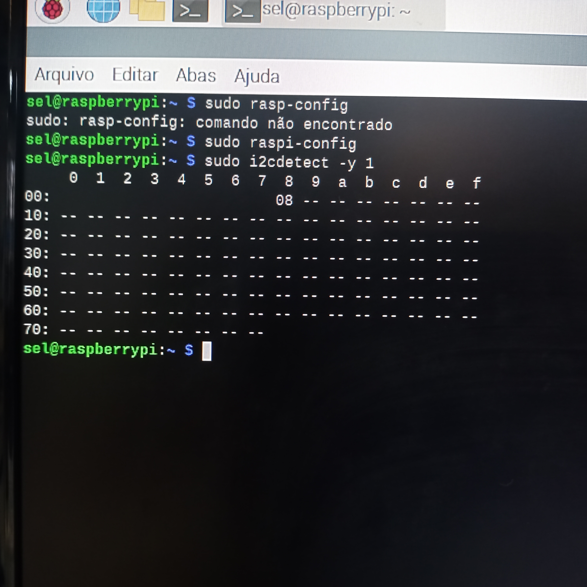
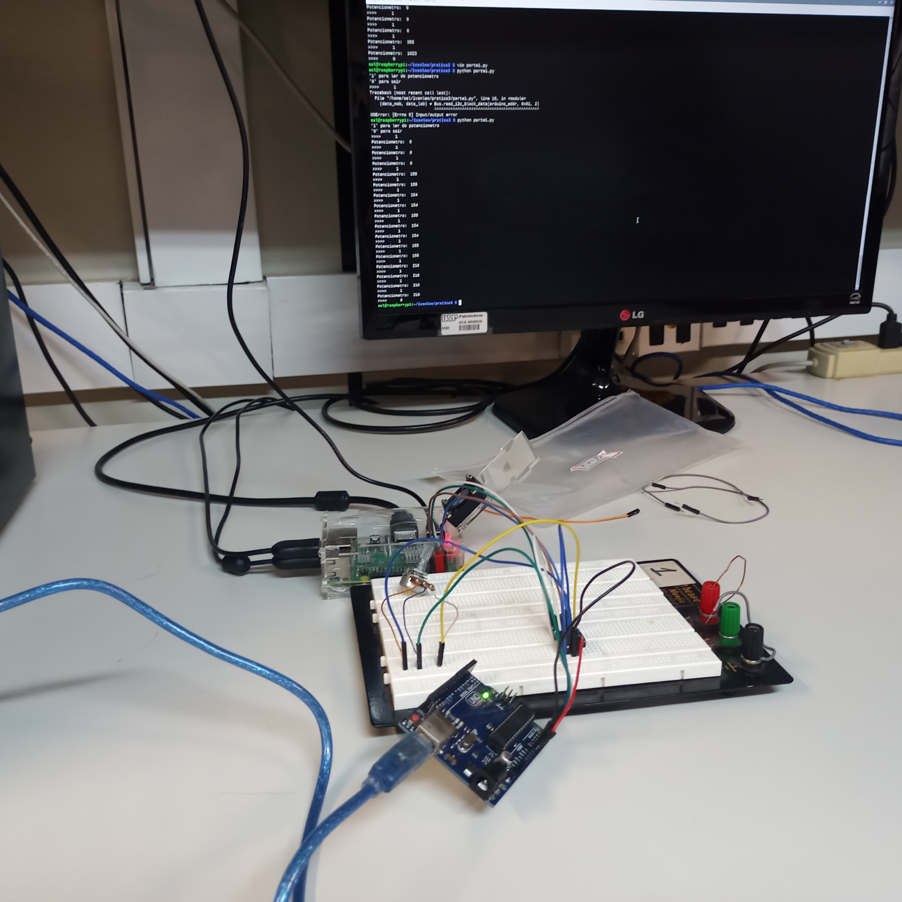
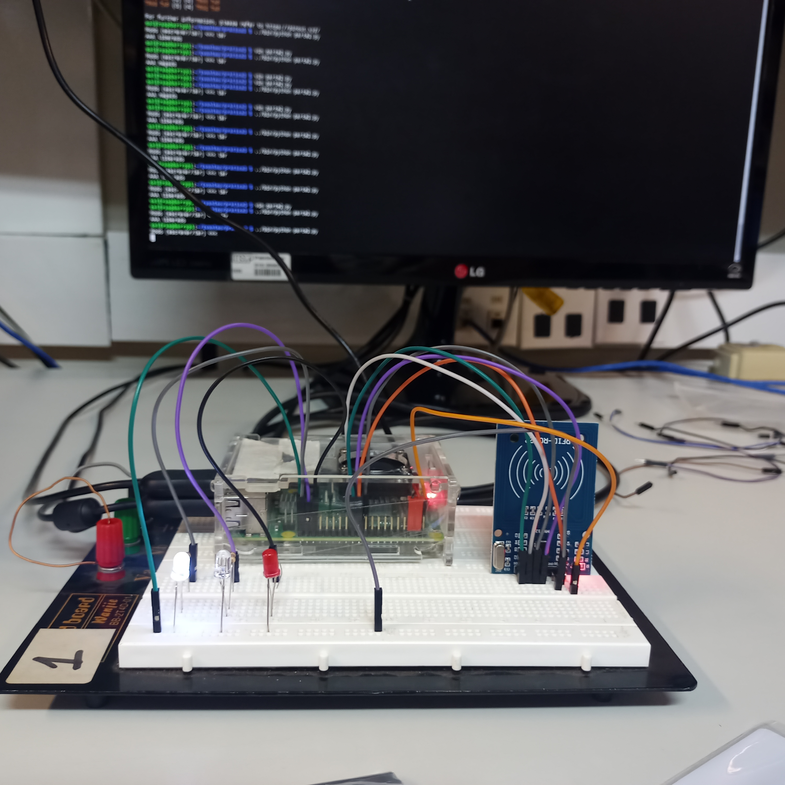

# Pratica 3
**Ivan Roberto Wagner Pancheniak Filho - 12624224**
**Leonardo Rodrigues de Sousa - 10716380**
## Parte 1

Nessa parte foi elaborado um programa em python que comandava um Arduino conectado
por I2C para requisicao de dados de um potenciomentro.

O codigo da RaspberryPI, em python, se encontra no arquivo [parte1.py](parte1.py), 
e o codigo do arduino no arquivo [arduino/arduino.ino](arduino/arduino.ino).
A montagem, e o resultado do comando `i2cdetect` nas figuras abaixo.

## Parte 2

Nessa parte foi elaborado um programa em python que adquiria os dados de um leitor de TAGs por SPI.

O codigo se encontra no arquivo [parte2.py](parte2.py), com a montagem presente na figura abaixo.

