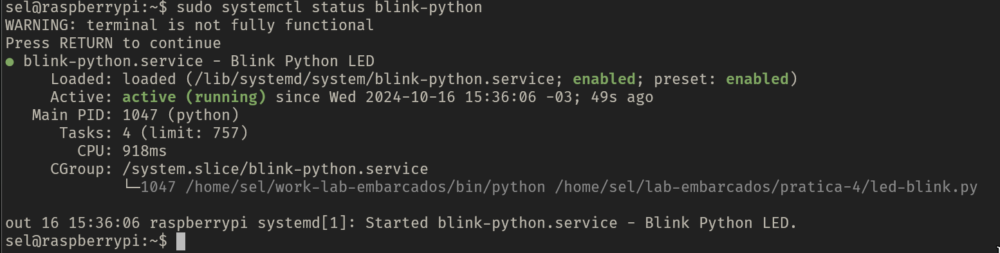

# Pratica 4
**Ivan Roberto Wagner Pancheniak Filho - 12624224**
**Leonardo Rodrigues de Sousa - 10716380**

Nessa parte foi elaborado um programa em python que funcionava como um servico do
systemd, o qual fazia um LED externo piscar continuamente.
O codigo do programa em python se encontra no arquivo [led-blink.py](led-blink.py), e
seu arquivo de configuracao de servico em [blink-python.service](blink-python.service).

Nao foi possivel tirar uma foto do momento em que o servico foi iniciado, mas temos o 
status do servico do comando `sudo systemctl status blink-python`. 

