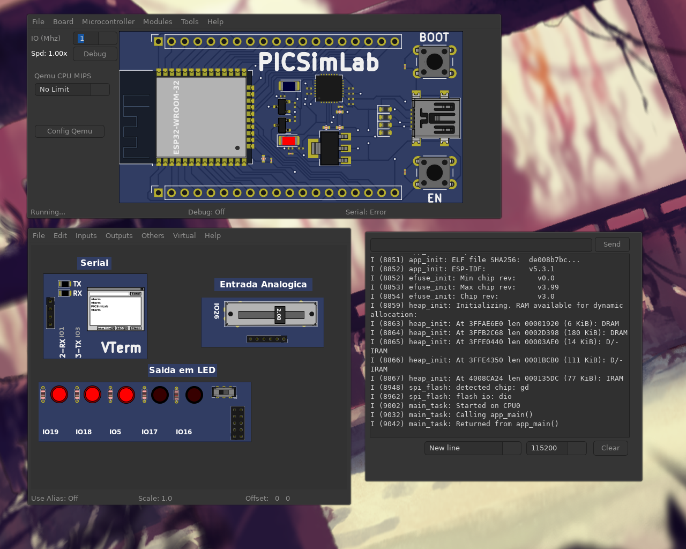
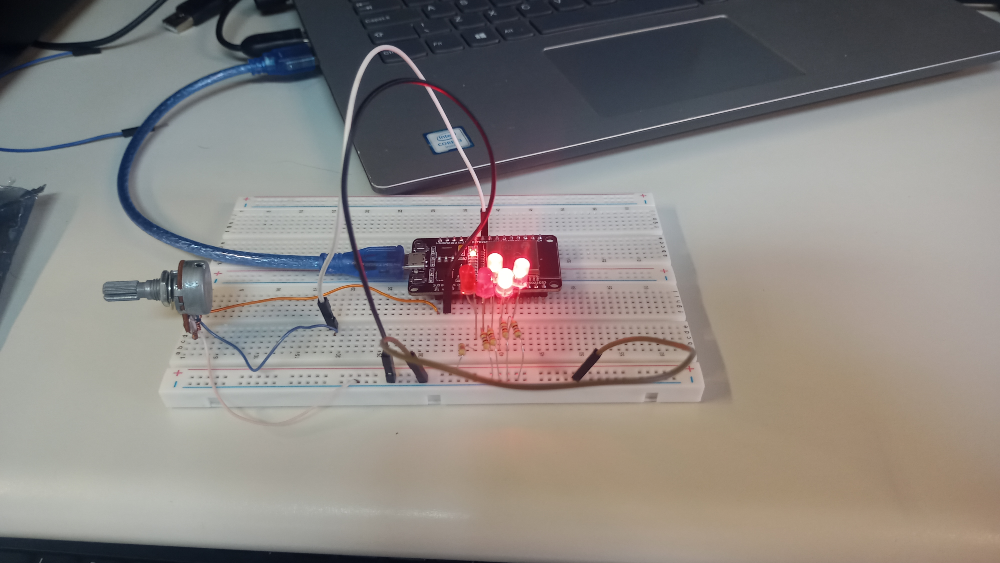
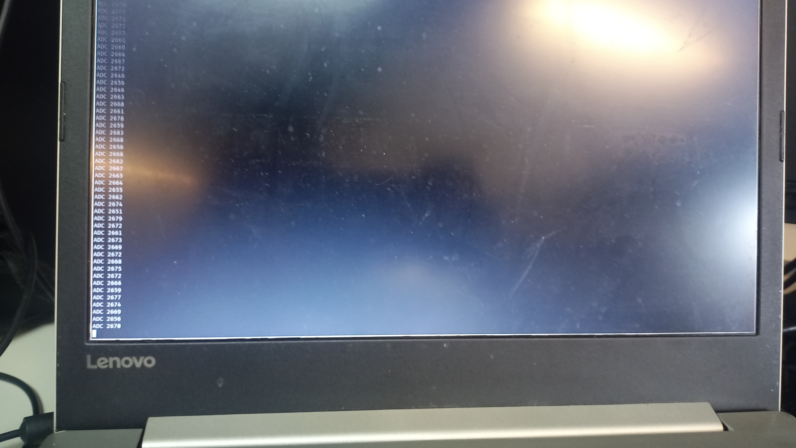

# Pratica 5 
**Ivan Roberto Wagner Pancheniak Filho - 12624224**

**Leonardo Rodrigues de Sousa - 10716380**

Nessa atividade foi utilizado o _SDK_ padrão da espressif para compilar o projeto, o qual pode ser adquirido,
em um sistema com Nix, com o comando a seguir, o qual irá colocar o terminal que o rodou em um _shell_ com as
ferramentas necessárias.

```sh
    nix --experimental-features 'nix-command flakes' develop github:mirrexagon/nixpkgs-esp-dev#esp32-idf -c $SHELL   
```

Para essa parte foi desenvolvido um sistema que utiliza de duas _tasks_ concorrentes para a captura de um sinal
no ADC da ESP32, e representa o valor com uma sequência de LEDs, em qual quantos mais LEDs brilham, maior o valor
sendo medido pelo ADC. Evitando acesso indevido na região crítica do código, utilizou-se de um _Mutex_ para 
controlar o acesso.

O código foi simulado no PICSimLab com uma pláca idêntica a presente no laboratório, sendo que esse workspace está 
presente no arquivo [workspace.pzw](parte1/workspace.pzw).



E também foi feito a montagem, com o resultado presente nas figuras a seguir.




