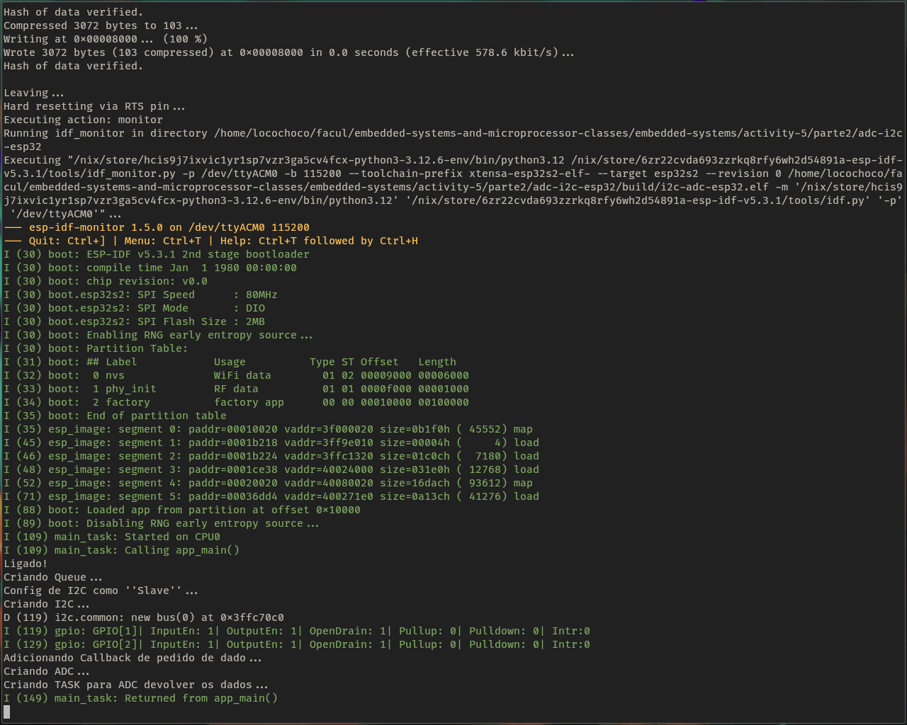

# Pratica 5 e Projeto Final
**Ivan Roberto Wagner Pancheniak Filho - 12624224**

**Leonardo Rodrigues de Sousa - 10716380**

Nessa atividade foi utilizado o _SDK_ padrão da espressif para compilar o projeto, o qual pode ser adquirido,
em um sistema com Nix, com o comando a seguir, o qual irá colocar o terminal que o rodou em um _shell_ com as
ferramentas necessárias.

```sh
    nix --experimental-features 'nix-command flakes' develop github:mirrexagon/nixpkgs-esp-dev#esp32-idf -c $SHELL   
```
## Parte 1

Para essa parte foi desenvolvido um sistema que utiliza de duas _tasks_ concorrentes para a captura de um sinal
no ADC da ESP32, e representa o valor com uma sequência de LEDs, em qual quantos mais LEDs brilham, maior o valor
sendo medido pelo ADC. Evitando acesso indevido na região crítica do código, utilizou-se de um _Mutex_ para 
controlar o acesso.

O código foi simulado no PICSimLab com uma pláca idêntica a presente no laboratório, sendo que esse workspace está 
presente no arquivo [workspace.pzw](parte1/workspace.pzw).


E também foi feito a montagem, com o resultado presente nas figuras a seguir.


## Parte 2

Nesse projeto final foi criado um sistema pelo qual uma ESP32 disponibiliza seu ADC para programas em uma Raspberry 
por meio de um _device driver_, comunicando por I2C.

### ESP32

#### Programar a Placa

Para programar a ESP32, é necessário ter o SDK padrão da espressif, versão v5.3.1.
Em sistemas com _Nix_, ele pode ser obtido pelo seguinte comando, o qual vai criar um shell com todas as ferramentas necessárias:

```sh
    nix --experimental-features 'nix-command flakes' develop github:mirrexagon/nixpkgs-esp-dev#esp-idf-full -c $SHELL
```

Após isso, é apenas necessário entrar na pasta `parte2/adc-i2c-esp32`, e rodar os seguintes comandos para compilar e carregar o
programa na placa, assumindo que a placa está conectada no computador:

```sh
idf.py set-target esp32-s2 # Trocar esp32-s2 pela placa de interesse
idf.py menuconfig # Isso irá abrir o menuconfig do projeto,
                  # nele são necessárias as seguintes alteracoes:
                  # 1 - Habilitar Component Config → ESP-Driver:I2C Configurations → Enable I2C debug log
                  # 2 - Mudar para Component config → ESP System Settings → Channel for console output → USB CDC
                  # caso a placa seja esp32-s2
idf.py -p /dev/ttyACM0 build flash monitor # Troque /dev/ttyACM0 pela porta em que se encontra a placa
```
#### Detalhes da Implementacão

Nesse código, foi utilizado a versão 1.0 do driver de I2C _slave_, podendo então não ser compatível com as próximas versões do SDK 
(veja [aqui](https://docs.espressif.com/projects/esp-idf/en/latest/esp32/api-reference/peripherals/i2c.html#i2c-clock-configuration) para
detalhes). Além disso, com a opcão 'Enable I2C debug log' ligada, é possível ver o driver de I2C em acão, como pode ser visto nas 
seguintes fotos.



### Kernel Module

```sh
    make -C $(nix-build -E '(import <nixpkgs> {}).linuxPackages_zen.kernel.dev' --no-out-link)/lib/modules/*/build M=$(pwd) modules
```


