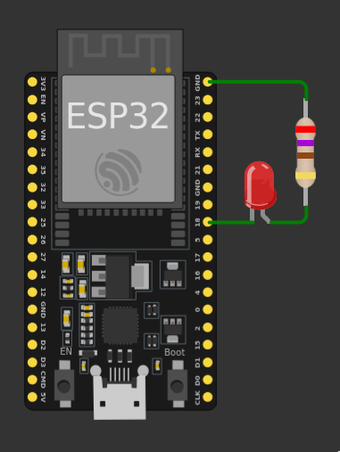
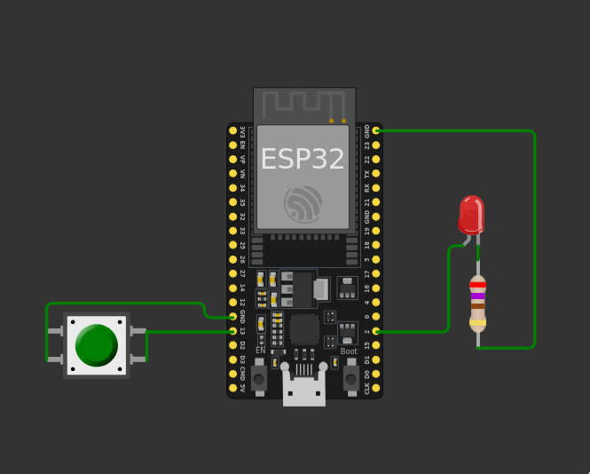
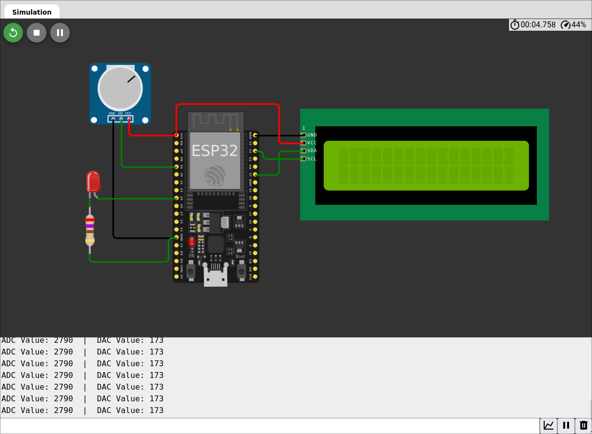

# Atividade Semanal 10

**Ivan Roberto Wagner Pancheniak Filho - 12624224**

## Exercício 1

### LED_blink

Para fazer um LED piscar a cada 500ms usando um código compativel com o framework nativo da Espressif IDE,
o seguinte código poderia ser usado.

```C
#include "driver/gpio.h"
#include "freertos/FreeRTOS.h"
#include "freertos/task.h"
#include <stdio.h>
#include <stdlib.h>

void app_main(void) {
  int led_pin = 18;
  gpio_set_direction(led_pin, GPIO_MODE_OUTPUT); // Coloca o pino de led_pin como saída
  while(1){
    gpio_set_level(led_pin, 1); // Coloca o pino em alto
    vTaskDelay(pdMS_TO_TICKS(500)); // Espera 500ms
    gpio_set_level(led_pin, 0); // Coloca o pino em baixo
    vTaskDelay(pdMS_TO_TICKS(500)); // Espera 500ms
  }
}
```



### timer_interrupt



### ADC_DAC_Pot_LCD



## Exercício 2

**Descreva de forma sucinta como funcionam os timers, interrupções, ADC e DAC
na ESP32 e quais as diferenças em relação a esses recursos no PIC18F4450?**

Todas essas capacidades da ESP32 funcionam dentro de módulos, os quais a ESP pode ser configurada para ter eles habilitados ou não,
permitindo economia de energia. Contudo, essa complexidade adicional requer que esses recursos sejam acessados por bibliotecas,
ou pelo sistema operacional rodando na ESP. O que é contrastante com a maneira que esses recursos eram acessados na PIC, os quais
"sempre estavam la", e podiam ser configurados e usados apenas controlando registradores.


