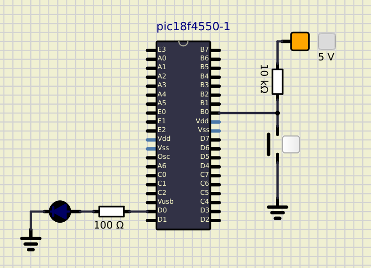
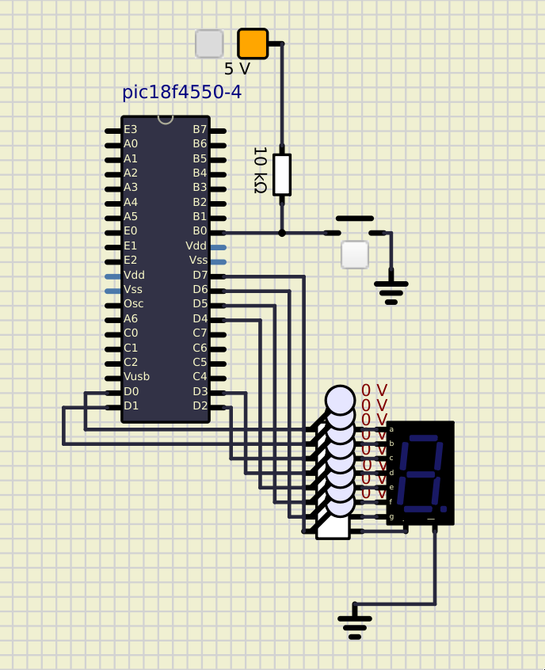

# Atividade Semanal 6

**Ivan Roberto Wagner Pancheniak Filho - 12624224**

Nessa atividade, foi utilizado o compilador aberto sdcc (versao 4.4.0) com os comandos
`sdcc -mpic16 -p18F4550 <pastta>/<arquivo>.c  --use-non-free -o <pasta>/`.

## Ilustrar no SimulIDE a conexão de um botão no pino B0 do microcontrolador PIC18F4550 na configuração Pull-Up (externo)

**o qual ao ser pressionado deverá mudar o estado de um
LED conectado ao pino D0, com base no exemplo da Atividade 1 Simule o circuito
carregando o arquivo hex gerado na compilação do programa em Linguagem C que
atende essa lógica, realizada no software no software MikroC PRO for PIC. Configurar
o valor do resistor Pull-Up para 10 kΩ e a frequência do clock do microcontrolador para
8 MHz.**



Codigo presente em [1/1.c](1/1.c).
```C
#include <delay.h>
#include <pic18fregs.h>

#pragma config XINST = OFF

#define BUTTON_PORT PORTBbits.RB0
#define BUTTON_TRIS TRISBbits.TRISB0
#define LED_LAT LATDbits.LATD0
#define LED_TRIS TRISDbits.TRISD0

void main(void) {
  ADCON1 |= 0XF; // Pinos digitais

  BUTTON_TRIS = 1; // BUTTON entrada
  LED_TRIS = 0;    // LED saida
  LED_LAT = 1;     // LED desligado

  while (1) {
    if (BUTTON_PORT == 0) {
      LED_LAT = !LED_LAT;
    }
  }
}
```

## Altere a lógica do programa do Exemplo 1 para piscar o LED a cada 500 ms (usando a função delay)

**enquanto o botão se manter pressionado. Ao soltar o botão, o LED deve
ser desligado.**

Codigo presente em [2/2.c](2/2.c).
```C
#include <delay.h>
#include <pic18fregs.h>

#pragma config XINST = OFF

#define BUTTON_PORT PORTBbits.RB0
#define BUTTON_TRIS TRISBbits.TRISB0
#define LED_LAT LATDbits.LATD0
#define LED_TRIS TRISDbits.TRISD0

void main(void) {
  ADCON1 |= 0XF; // Pinos digitais

  BUTTON_TRIS = 1; // BUTTON entrada
  LED_TRIS = 0;    // LED saida
  LED_LAT = 1;     // LED desligado

  while (1) {
    if (BUTTON_PORT == 0) {
      LED_LAT = ~LED_LAT;
      delay1mtcy(1); // 500ms @ 8MHz
    } else {
      LED_LAT = 0;
    }
  }
}
```

## Conforme exemplo demonstrado em aula (Exemplo 2), implementar o algoritmo

**utilizado para tratar o efeito bounce presente no programa do Exemplo 1. Compilar o
programa no MikroC PRO for PIC e implementar o circuito no Simul IDE carregando o
firmware (arquivo hex gerado na compilação). Ajustar o clock do microcontrolador
PIC18F4550 para 8 MHz e o montar o botão na configuração pull-up (ajustar o valor do
resistor de pull-up para 10 kΩ) no SimulIDE.**

Codigo presente em [3/3.c](3/3.c).
```C 
#include <delay.h>
#include <pic18fregs.h>

#pragma config XINST = OFF

#define BUTTON_PORT PORTBbits.RB0
#define BUTTON_TRIS TRISBbits.TRISB0
#define LED_LAT LATDbits.LATD0
#define LED_TRIS TRISDbits.TRISD0

void main(void) {
  ADCON1 |= 0XF; // Pinos digitais

  BUTTON_TRIS = 1; // BUTTON entrada
  LED_TRIS = 0;    // LED saida
  LED_LAT = 0;     // LED desligado
  int button_pressed = 0;
  while (1) {
    if (BUTTON_PORT == 0 && button_pressed == 0) {
      LED_LAT = !LED_LAT;
      button_pressed = 1;
      delay1ktcy(100); // 50ms @ 8MHz
    } else if (BUTTON_PORT == 1 && button_pressed == 1) {
      button_pressed = 0;
      delay1ktcy(100); // 50ms @ 8MHz
    }
  }
}
```

## Implemente no SimulIDE o programa no Exemplo 3 – Display de 7 Segmentos

**Para tanto, realize as ligações de um display de 7 segmentos disponível no simulador no
PORTD do microcontrolador. Ajustar o clock do microcontrolador PIC18F4550 para 8
MHz e o montar o botão na configuração pull-up (ajustar o valor do resistor de pull-up
para 10 kΩ) no SimulIDE.**




Codigo presente em [4/4.c](4/4.c).
```C
#include <delay.h>
#include <pic18fregs.h>

#pragma config XINST = OFF

#define BUTTON_PORT PORTBbits.RB0
#define BUTTON_TRIS TRISBbits.TRISB0
#define SEG7_LAT LATD
#define SEG7_TRIS TRISD

int seg(int number) {
  switch (number) {
  case 0:
    return 0b00111111;
  case 1:
    return 0b00000110;
  case 2:
    return 0b01011011;
  case 3:
    return 0b01001111;
  case 4:
    return 0b01100110;
  case 5:
    return 0b01101101;
  case 6:
    return 0b01111101;
  case 7:
    return 0b00000111;
  case 8:
    return 0b01111111;
  case 9:
    return 0b01101111;
  default:
    return 0;
  }
}

int main(void) {
  ADCON1 |= 0XF; // Pinos digitais

  BUTTON_TRIS = 1; // BUTTON entrada
  SEG7_TRIS = 0;   // SEG7 saida
  SEG7_LAT = 0;
  int button_pressed = 0;
  int number = 0;
  while (1) {
    if (BUTTON_PORT == 0 && button_pressed == 0) {
      button_pressed = 1;
      SEG7_LAT = seg(number);
      number = (number + 1) % 10;
      delay1ktcy(100); // 50ms @ 8MHz
    } else if (BUTTON_PORT == 1 && button_pressed == 1) {
      button_pressed = 0;
      delay1ktcy(100); // 50ms @ 8MHz
    }
  }
}
```

## Levando em consideração os pontos importantes sobre a família de microcontroladores PIC

**compare o PIC18F4550 com um microcontrolador da família MSC-51 (por
exemplo: AT89S51) estudado anteriormente (focar nas características chaves e mais
representativas entre eles: arquitetura, conjunto de instruções, pinagem, periféricos e
funcionalidades disponíveis e diferenças quantitativas nas especificações)**

Existem varias diferencas entre os microcontroladores PIC18F4550 e AT89S51 (8051). O PIC18F trabalha com palavras de 16bits,
enquanto que o AT89 com palavras de 8bits. O PIC tem um conjunto RISC de instrucoes, enquanto que o 8051 possui um conjunto CISC.
Ambos possuem uma quantidade parecida de pinos externos, e tem pinos com ADC.
E o PIC apresenta uma arquitetura Harward e tem pipeline, enquanto que o 8051 tem arquitetura Von Neuman.

## Após analisar a plataforma EasyPIC v7 fisicamente durante a aula correspondente e com

**base no material relacionado (manual do kit ou tirar fotos da placa durante a aula, caso
preferir), faça um breve resumo (listagem) sobre os principais recursos e periféricos
disponíveis nesta placa, listando suas principais funcionalidades para prototipagem em
sistemas embarcados.**


