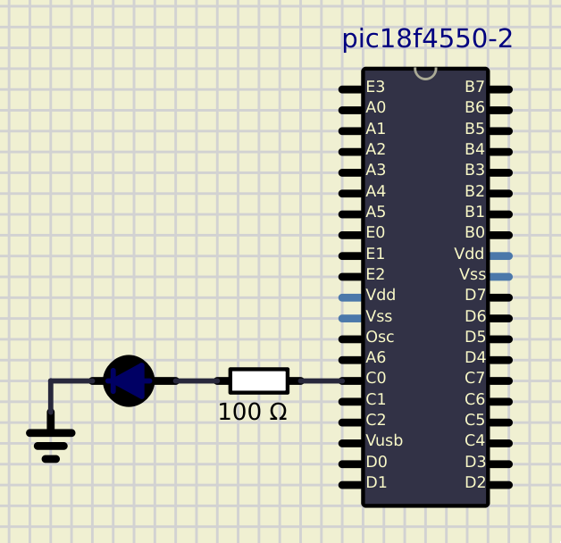
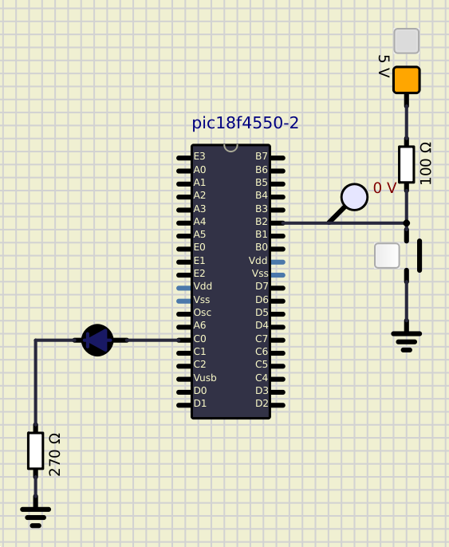

# Atividade Semanal 7

**Ivan Roberto Wagner Pancheniak Filho - 12624224**

Nessa atividade, foi utilizado o compilador aberto sdcc (versao 4.4.0) com os comandos
`sdcc -mpic16 -p18F4550 <pastta>/<arquivo>.c  --use-non-free -o <pasta>/`.

## Exercício 1

### Implemente no SimulIDE, um programa para piscar um LED a cada 1 segundo
**, utilizando o temporizador Timer0 (TMR0) do PIC18F4550.**



Codigo presente em [1/1.c](1/1.c).
```C#include <delay.h>
#include <pic18fregs.h>

#pragma config XINST = OFF

#define LED_LAT LATCbits.LATC0
#define LED_TRIS TRISCbits.TRISC0

void main(void) {
  ADCON1 |= 0XF; // Pinos digitais

  LED_TRIS = 0; // LED saida
  LED_LAT = 0;  // LED desligado

  T0CON = 0b00000111;
  // Timer 0
  // Desativado - 0
  // 16 bits    - 0
  // Cic. Instr - 0
  // Subida     - 0
  // PSA Habili - 0
  // 1:256      - 1
  //              1
  //              1

  // Com CLOCK de 8MHz -> 0.5us de Cic. Instr,  Prescaler de 1:256, temos que
  // cada bit vale 128us. Para conseguir 1s -> 7812*128us = 0.99s Portanto, TMR0
  // = (65535 - 7812) = 61629 = E17B
  const int TIMER_LOWER = 0x7B;
  const int TIMER_HIGHER = 0xE1;
  TMR0L = TIMER_LOWER;
  TMR0H = TIMER_HIGHER;
  LED_LAT = 0;
  while (1) {
    if (INTCONbits.TMR0IF == 1) {
      LED_LAT = ~LED_LAT;
      // Recarrega e reseta o timer
      TMR0L = TIMER_LOWER;
      TMR0H = TIMER_HIGHER;
      INTCONbits.TMR0IF = 0;
    }
  }
}
```

### Implemente no SimulIDE um programa para acionar uma a saída (representada por um LED que irá piscar)
**a cada intervalo de tempo correspondente a contagem de tempo máxima do Timer3 (TMR3)**


Codigo presente em [2/2.c](2/2.c).
```C
#include <delay.h>
#include <pic18fregs.h>

#pragma config XINST = OFF

#define LED_LAT LATCbits.LATC0
#define LED_TRIS TRISCbits.TRISC0

void main(void) {
  ADCON1 |= 0XF; // Pinos digitais

  LED_TRIS = 0; // LED saida
  LED_LAT = 0;  // LED desligado

  T3CON = 0b10110000;
  // Timer 3
  // 16 bits    - 1
  // T3CCP2     - 0
  // 1:8        - 1
  //              1
  // T3CPP1     - 0
  // Clock Extrn- 0
  // Clock Intr - 0
  // Habilitar  - 0

  // Para ter a contage maxima, comecar a contar do 0
  const int TIMER_LOWER = 0;
  const int TIMER_HIGHER = 0;
  TMR3L = TIMER_LOWER;
  TMR3H = TIMER_HIGHER;
  T3CONbits.TMR3ON = 1;
  while (1) {
    if (INTCONbits.TMR3IF == 1) {
      LED_LAT = ~LED_LAT;
      // Recarrega e reseta o timer
      TMR3L = TIMER_LOWER;
      TMR3H = TIMER_HIGHER;
      INTCONbits.TMR3IF = 0;
    }
  }
}
```

### Implemente no SimulIDE um programa para acionar uma a saída (representada por um LED que irá piscar)
**a cada intervalo de tempo correspondente a contagem de tempo máxima do Timer2 (TMR2)**


Codigo presente em [3/3.c](3/3.c).

```C
#include <delay.h>
#include <pic18fregs.h>

#pragma config XINST = OFF

#define LED_LAT LATCbits.LATC0
#define LED_TRIS TRISCbits.TRISC0

void main(void) {
  ADCON1 |= 0XF; // Pinos digitais

  LED_TRIS = 0; // LED saida
  LED_LAT = 0;  // LED desligado

  T2CON = 0b01111011;
  // Timer 2
  // Unimplemented   - 0
  // Postscaler 1:16 - 1
  //                   1
  //                   1
  //                   1
  // TMRON             0
  // Prescaler 1:16    1
  //                   1

  // Para ter a contage maxima, comecar a contar do 0
  const int TIMER_INIT = 0;
  TMR2 = TIMER_INIT;
  T2CONbits.TMR2ON = 1;
  while (1) {
    if (PIR1bits.TMR2IF == 1) {
      LED_LAT = ~LED_LAT;
      // Recarrega e reseta o timer
      TMR2 = TIMER_INIT;
      PIR1bits.TMR2IF = 0;
    }
  }
}
```
## Exercício 2


### Implemente no SimulIDE um programa para acionar uma a saída (representada por um LED que irá piscar)
**sempre que for sinalizado um evento por nterrupções externas**



Codigo presente em [4/4.c](4/4.c).

```C
#include <delay.h>
#include <pic18fregs.h>

#pragma config XINST = OFF

#define LED_LAT LATCbits.LATC0
#define LED_TRIS TRISCbits.TRISC0

void timer_isr(void) __interrupt(1) __using(1) {
  if (INTCON3bits.INT2IF == 1) {
    LED_LAT = ~LED_LAT;
    INTCON3bits.INT2IF = 0;
  }
  return;
}

void main(void) {
  ADCON1 |= 0XF; // Pinos digitais

  LED_TRIS = 0; // LED saida
  LED_LAT = 0;  // LED desligado
  INTCON2bits.RBPU = 0;
  // Porta B liga em 0, tem que ligar os resistores de pullup na porta

  INTCONbits.GIEH = 1;     // Interrupt de alta prioridade
  RCONbits.IPEN = 1;       // Habilita ter niveis de prioridade
  INTCON3bits.INT2IF = 0;  // Zerar a flag caso ela nao esteja ja zerada
  INTCON3bits.INT2IE = 1;  // Habilita a interrupcao 2
  INTCON2bits.INTEDG2 = 0; // Habilita ao presionar a tecla
  TRISBbits.RB2 = 1;       // Pino B como entrada

  while (1) {
  }
}
```

