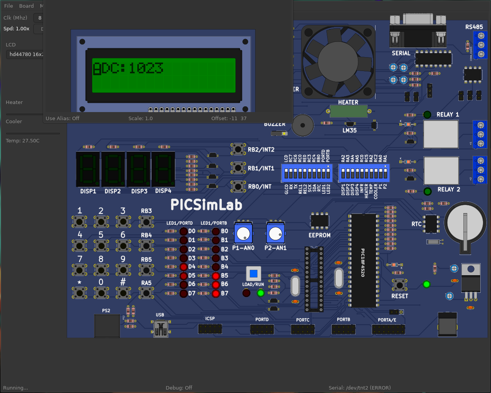

# Atividade Semanal 8

**Ivan Roberto Wagner Pancheniak Filho - 12624224**

Nessa atividade, foi utilizado o compilador aberto sdcc (versao 4.4.0) com os comandos
`sdcc -mpic16 -p18F4550 <pastta>/<arquivo>.c  --use-non-free -o <pasta>/`, e o emulador
de PIC PicSimLab.

## Exercício 1

O código para controlar o LCD e receber dados do ADC está no arquivo [main.c](code/main.c), no qual foi feito a seguinte montagem no simulador PicSimLab, com o workspace do arquivo [workspace.pzw](workspace.pzw).

