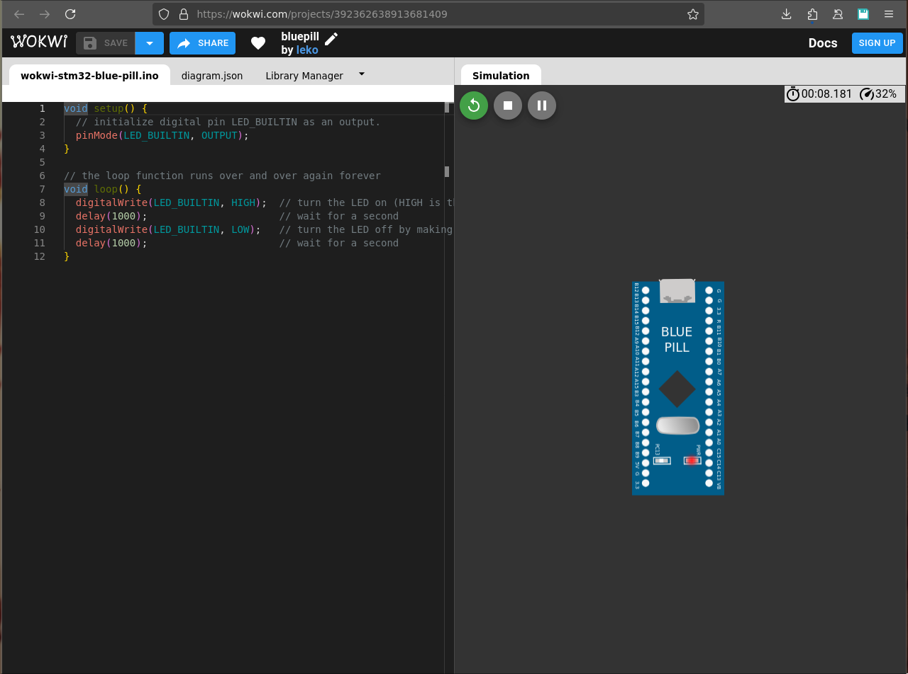

# Atividade Semanal 9

**Ivan Roberto Wagner Pancheniak Filho - 12624224**

## Exercício 1

**Analisando criticamente diferentes arquiteturas de microcontroladores (por meio
dos datasheets), faça um breve e sucinto comparativo entre os principais recursos
(focar nos mais importantes e essenciais que você consegue observar, com base
no contato prévio e recursos utilizados nos projetos anteriores) dos
microcontroladores PIC18F4550, STM32F103C8T6 (ou STM32F303VC –
escolher um ou outro), e ESP32 WROOM Xtensa Dual Core (versão disponível
na placa Devkit).**

A PIC18F4550 é a mais _simples_ de todas, sendo apenas de 16 bits, e operando a um frequência inferior
as outras placas. Contudo, em sua _simplicidade_, ela é a mais simples de ser trabalhada, possuindo 
registradores faceis de serem configurados, e recursos como ADCs e Timers.

A STM32F103C8T6 por outro lado, ao ser de 32 bits, apresenta uma maior dificuldade caso se deseja fazer
programacão "bare-metal". Contudo, ela apresenta muitos mais recursos, e uma capacidade de computacão muito maior,
podendo rodar sistemas operacionais que, em troca de um binário final maior, reduzem a complexidade do código fonte.
Além disso, esse microprocessador tem um bom ADC.

A ESP32 WROOM Xtensa Dual Core, além de ser 32 bits, apresenta duas CPUs, possibilitando programacão concorrente,
o que a permite funcionar em situacões que demandam ainda mais computacão, além de ter um chip de WiFi integrado,
um DAC integrado, e poder rodar um SO como o RTOS. Todavia, isso vem ao custo de um ADC bom, o qual sofre quando certos
módulos do processador estão ligados.


## Exercício 2

**Testar no Wokwi o exemplo demostrado em aula referente ao blink LED na placa
BluePill (microcontrolador STM32F103) ou Placa Nucleo C031C6, observando
a programação no framework Arduino (e considerações caso fosse utilizado a IDE
nativa (Cube IDE)) conforme tutoriais nos slides do Cap. 9.**



## Exercício 3

**Demostrar como acionar a saída PC13 (LED onboard na BluePill) a partir da
programação “bare-metal” por meio da configuração direta de registradores
(apresentar apenas as linhas de código e explicações sobre a configuração dos
registradores envolvidos - não é necessário testar na placa, nem usar a IDE ou
simulador).**

Para acionar a saída `PC13` o seguinte código em C poderia ser usado:
```C
    RCC->APB2ENR = 0x00000010; // Habilita PORTC
    GPIOC->CRH   = 0x00200000; // Colocam o port 13 de C como saída
    GPIOC->ODR   = 0x00002000; // Coloca PC13 em sinal alto
```

