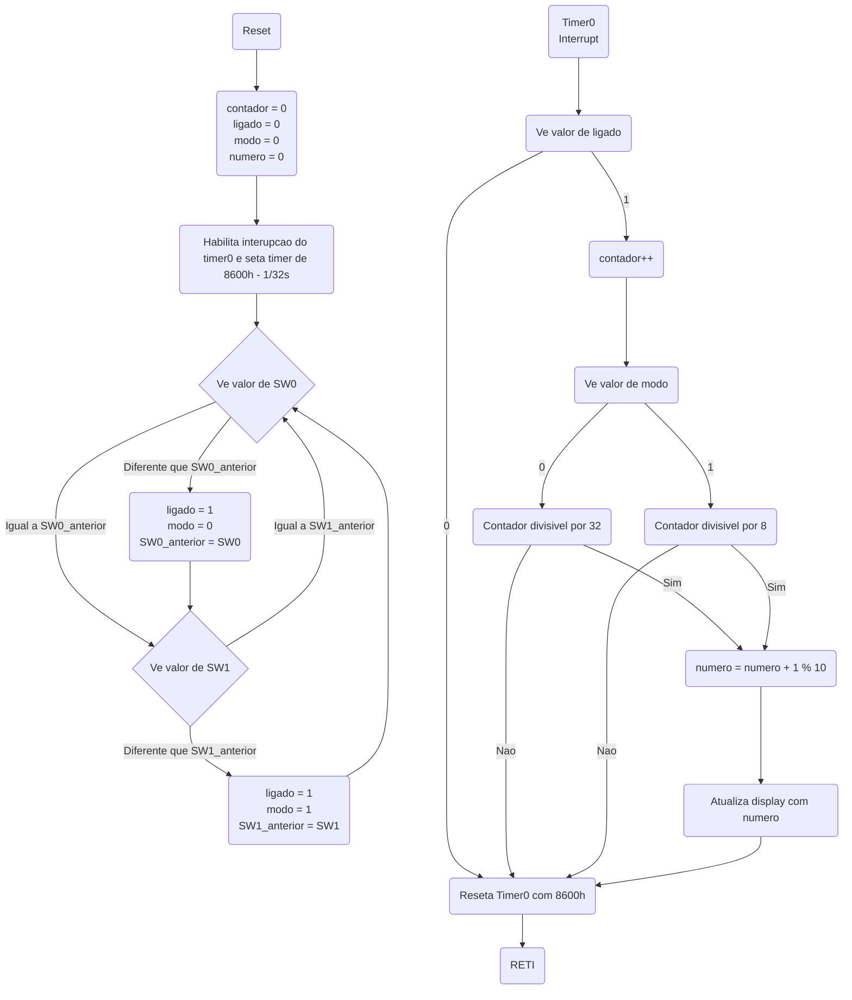
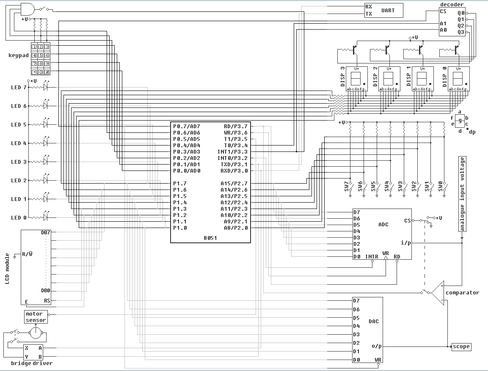

# Projeto 1 - Cronômetro Digital usando Assembly e 8051

**Ivan Roberto Wagner Pancheniak Filho - 12624224**

Nesse projeto de Assembly de 8051 foi desenvolvido um contador com velocidade variável,
expondo o número atual em um _display_ de 7 segmentos, e usando interrupções do temporizador
interno para manter a contagem em um tempo constante.

O programa está no arquivo [timer.asm](timer.asm), e ele tem o seguinte fluxo de código:

Sendo que cada registrador tem as seguintes funções:

|    |              |
|----|--------------|
| r0 | numero       |
| r1 | contador     |
| r2 | ligado       |
| r3 | modo         |
| r4 | SW0_anterior |
| r5 | SW1_anterior |

## Diagrama das conexoes com o processador

## Video Explicativo do Funcionamento do Programa

