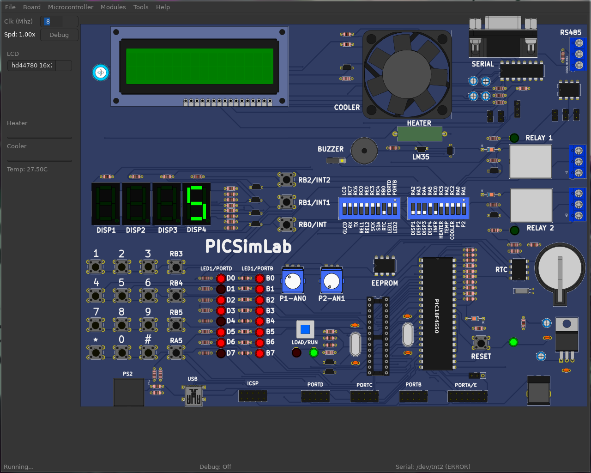

# Projeto 2 - 

**Ivan Roberto Wagner Pancheniak Filho - 12624224**

Nesse projeto de Aplicação de Microprocessadores foi implementado um _Timer_ usando interrupts da PIC.
Para faze-lo, foi usado os conceitos de interrupcões internas (TIMER0) e externas (INT0 e INT1),
com elas, foi feito um contador que pode ter sua frequência de contagem alterada de 1s para 0,25s e
vice versa.

A configuracão dos principais blocos foi feita da seguinte maneira:

## TIMER0

Usando o prescaler de 256, foi apena necessário usar o TIMER0 no modo 0 bits, o qual foi configurado
para causar um interrupt após o overflow da seguinte maneira.
```C
// Config do TIMER0 ----
  T0CON = 0b01000111;
  // Timer 0
  // Desativado - 0
  // 8 bits     - 1
  // Intern Clk - 0
  // Subida     - 0
  // PSA Habili - 0
  // 1:256      - 1
  //              1
  //              1
  INTCONbits.TMR0IF = 0;  // Zerar a flag caso ela nao
                          // esteja ja zerada
  INTCON2bits.TMR0IP = 0; // Habilitar interrupt de prioridade
  INTCONbits.TMR0IE = 1;  // Habilita Timer0 gerar
                          // interrupts
  TMR0 = TIMER0_LOAD;     // Carregar com o

```
Nessa configuracao, o valor a ser carregado foi o suficiente para gerar um delay de 0,025s. A razão da
escolha desse valor e não de 0,25s foi, em um primeiro momento, para permitir debounce dos botões de
INT0 e INT1, mas essa opcão não foi implementada.

## INT0 e INT1

Esses interrupts externos foram configurados apenas ao habilitar PULL-UP nas suas portas, e habilitando 
seus interrupts.
```C
  //------
  INTCON2bits.RBPU = 0; // Pullup nos botoes em B
  // Config de INT0
  // Porta B liga em 0, resistores de pullup habilitados
  INTCONbits.INT0IF = 0;   // Zerar a flag caso ela nao esteja ja zerada
  INTCONbits.INT0IE = 1;   // Habilita a interrupcao 2
  INTCON2bits.INTEDG0 = 0; // Habilita ao presionar a tecla

  IPR1bits.TMR1IP = 1; // Habilitar prioridade
  TRISBbits.RB0 = 1;   // Pino B0 como entrada do Interrupt

  //------
  // Config de INT1
  // Porta B liga em 0, resistores de pullup habilitados
  INTCON3bits.INT1IF = 0;  // Zerar a flag caso ela nao esteja ja zerada
  INTCON3bits.INT1IE = 1;  // Habilita a interrupcao 2
  INTCON2bits.INTEDG1 = 0; // Habilita ao presionar a tecla
  TRISBbits.RB1 = 1;       // Pino B0 como entrada do Interrupt
```

## Interrupts

Para facilitar o código, fez-se com que todos os interrupts tivessem a mesma prioridade, sendo feito
pela configuracão a seguir:
```C

  //------
  RCONbits.IPEN = 0;   // Desabilita prioridades nos interrupts
  INTCONbits.PEIE = 1; // Habilita interrupts de perifericos
  INTCONbits.GIE = 1;  // Habilita que todos os interrupts ocorram
  // Ativacao do TIMER0
  T0CONbits.TMR0ON = 1;

```

## Display de 7 Segmentos

Para o display de 7 segmentos, foi feito uma rotina que utiliza de uma lookup-table para carregar o 
port D com os bits adequados para cada número.
```C
#define SEVSEG_DISPLAY LATD
#define SEVSEG_DISPLAY_TRIS TRISD
int numeros_para_7seg[] = {
    0b00111111, 0b00000110, 0b01011011, 0b01001111, 0b01100110,
    0b01101101, 0b01111101, 0b00000111, 0b01111111, 0b01101111,
};
void config_7seg(void) {
  SEVSEG_DISPLAY_TRIS = 0x00; // Todos os pinos do display sao de saida
  SEVSEG_DISPLAY = 0x00;      // Todos os pinos do display comecam desligados
}
void printa_numero(int numero) {
  if (numero > 10)
    return;
  SEVSEG_DISPLAY = numeros_para_7seg[numero];
}
```

## Montagem no simulador

Por problemas com o SimulIDE, a simulacão do código foi feito no PicSimLab, com a workspace presente [nesse arquivo](picsimlab/timer.pzw).



## Comparacão com o projeto anterior

Em termos de funcionamento, ambos os projetos são semelhantes. Um utilizou de interrupts no 8051, e esse na PIC. Todavia,
nesse projeto quase todo o código roda por interrupts, em contraste com a necessidade de fazer o pooling da entrada do usuário
no 8051. Além disso, por ser feito em C, codificar foi muito mais simples, mas o binário final é muito maior que a versão em 
Assembly do 8051.

