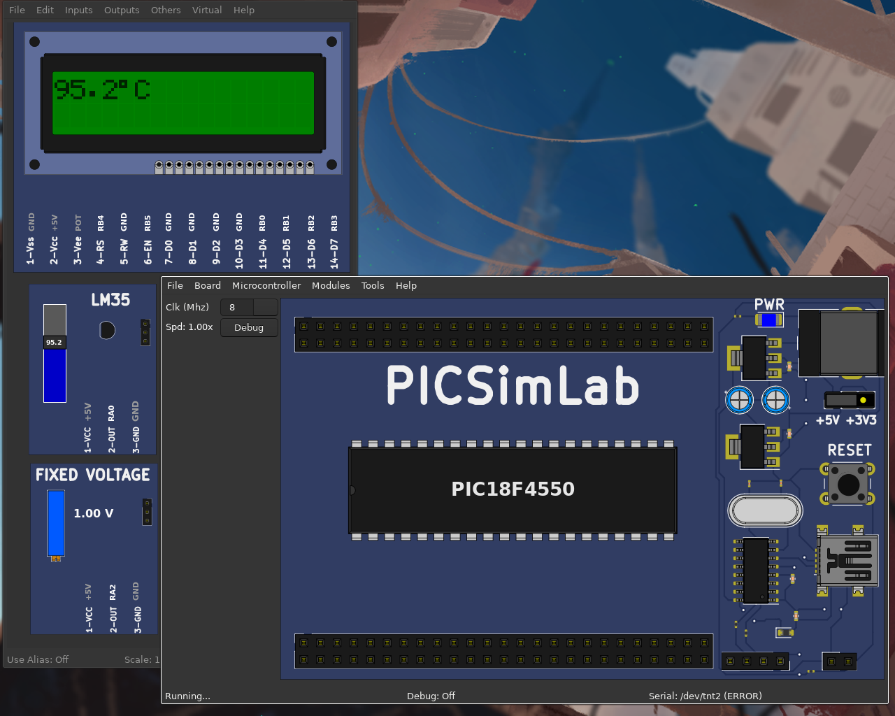

# Projeto 3 - 

**Ivan Roberto Wagner Pancheniak Filho - 12624224**

Nesse projeto de _Aplicação de Microprocessadores_ foi implementado um termômetro utilizando com o sensor LM35, o ADC da PIC18f4550
e um LCD HD44780 para apresentar o valor medido.

Para compilar o código feito, é necessário ter o compilador `sdcc` com suporte para PIC, e `make` para rodar o `Makefile` na pasta `code`,
na qual, o código principal está na pasta `src` de nome [main.c](code/src/main.c).

## Configuracão do ADC

Para a correta leitura do sensor LM35, no lugar de se usar as tensões de referência padrões,utilizou-se de referênciasexternas de 1V.
A razão disso se dá pelas tensões do LM35 não variarem de 0-5V na faixa de 0C-100C, e portanto, teriamos níveis do ADC
que não seriam alcancados realisticamente.
Assim, para se ter um melhor uso das faixas do ADC, fazer o ADC usar uma faixa de 0-1V faz com que ele tenha uma maior
resolucão sobre a temperatura medida, permitindo a representacão da primeira casa decimal da temperatura medida.

Para que o ADC da PIC usa-se essas tensões externas, as seguintes configuracões tiveram que ser feitas nos seus registradores 
(presentes [aqui](https://github.com/loco-choco/embedded-systems-and-microprocessor-classes/blob/main/microprocessors/project-3/code/src/main.c#L13-L16)):
```C
  ADCON1bits.PCFG = 0b1100; // Faz os pinos AN0, AN1 e AN2 serem analogicos, e
                            // os outros digitais
  ADCON1bits.VCFG1 = 1;     // Usa o pino em AN2 como referencia Vref- (1V)
  ADCON1bits.VCFG0 = 1;     // Usa o pino em AN1 como referencia Vref+ (1V)
```

## Apresentacão no LCD HD44780

Pela decisão de se usar o compilador `sdcc` para esse projeto, não foi possível utilizar a
biblioteca disponível na plataforma do mikroC, e portanto teve-se que desenvolver uma interface
para interagir com a placa HD44780 no modo 4 bits.

Como referência para o desenvolvimento desse código temos o seguinte [_datasheet_](https://www.sparkfun.com/datasheets/LCD/HD44780.pdf)
da _Hitachi_, do qual foi possível criar rotinas que são compatíveis com o protocolo da placa.

Essas rotinas estão presentes nos arquivos [HD44780.H](code/include/HD44780.h) (protótipos das funcões),
[HD44780.c](code/src/HD44780.c) (implementacão das funcões) e [pins.h](code/include/pins.h) (definicão dos _ports_ para serem usados
para a comunicacão com a placa), e são usadas das seguintes maneiras no código principal.

```C
    config_lcd();                   // Configura o LCD
    . . .
    print_number_2units(temp / 10); // Desenha as casas das unidades e dezenas da temperatura medida
    print_char_lcd('.');            // Desenha o caracter '.' para separar as casas decimais das unidades
    print_number_1unit(temp % 10);  // Desenha a casa decimal da temperatura medida
    print_char_lcd(0b11011111);     //Desenha o caracter '°' dos graus
    print_char_lcd('C');            // Desenha a letra 'C' da medida
    go_to_start_lcd();              // Retorna o cursor ao inicio para a próxima escrita
```

## Montagem no Simulador

A simulacão do código foi feita no PICSimLab, e por ele apresentar o sensor de temperatura LM35, não foi necessário
simular o comportamento do programa com um potenciômetro. Para executar a mesma simulacão é apenas necessário abrir
a workspace presente [nesse arquivo](picsimlab/workspace.pzw) com PICSimLab.

## Resultado Final

Com tudo feito, o resultado final é o demonstrado na figura a seguir, o qual segue as especificacões postas no projeto.




