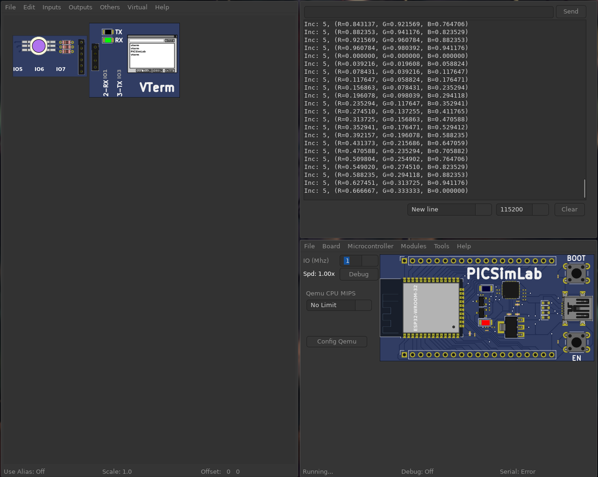

# Projeto 4 - 

**Ivan Roberto Wagner Pancheniak Filho - 12624224**

## Parte 1

O projeto do programa 1 está presente no projeto do Wokwi no link [https://wokwi.com/projects/416925338414664705](https://wokwi.com/projects/416925338414664705), e no arquivo [parte1/parte1.ino](parte1.ino).

## Parte 2

O projeto do programa 2 está na pasta [parte2/](parte2/), em que há o arquivo das _spare parts_ da montagem para simulação no PicSimLab.

